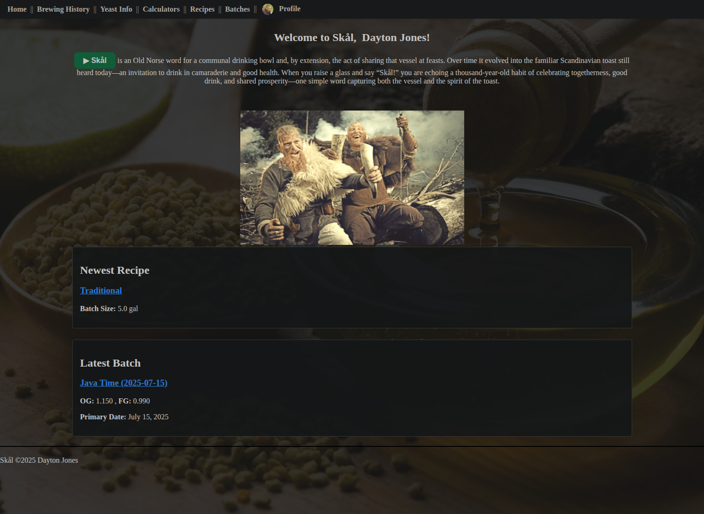
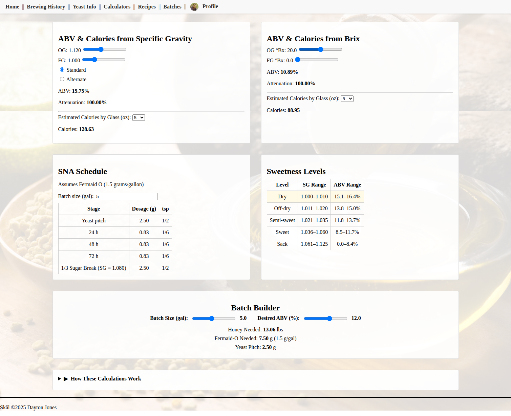
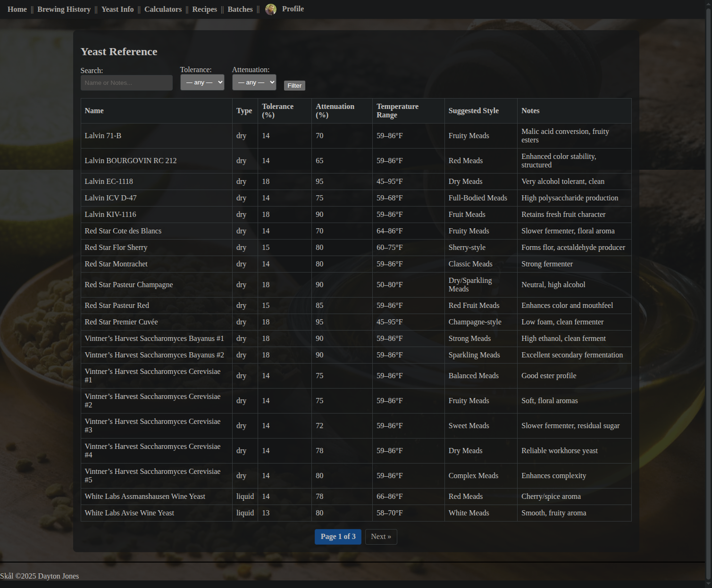

# Skål

Skål is a modern web application for managing your mead brewing journey—from crafting recipes to tracking batches and calculating ABV & calories. Designed with the homebrewer in mind, it features an intuitive interface, responsive design, and robust tooling for both casual and meticulous brewers alike.

Though built primarily for meadmakers (it's what I brew!), Skål is just as capable for beer and cider.

---

## 🌟 Features

* **Recipe Management**: Create, edit, and browse brewing recipes with detailed ingredients and step-by-step instructions.
* **Batch Tracking**: Log fermentation batches with OG, FG, start/transfer/bottle dates, notes, and photo galleries.
* **ABV & Calorie Calculator**: Calculates ABV using the alternate formula and estimates calories per 5 oz. glass.
* **Ingredient Autocomplete**: Ingredient names auto-saved and suggested for quicker input.
* **Image Support**: Upload and resize images (max 800x800), organized per batch.
* **Theme Toggle**: Supports light and dark themes, saved per user profile.
* **User Authentication**: Secure login, registration, and profile customization.
* **Multi-User Support**: Users can manage their own recipes and batches, or make them public.
* **Responsive Design**: Built with Tailwind CSS + DaisyUI for a sleek, mobile-friendly interface.
* **Export Options**: Export your recipes and batches as PDF, CSV, JSON, TXT, or SQL backups.

---

## 🚀 Quick Start (Docker Compose)

### Prerequisites

* [Docker](https://docs.docker.com/get-docker/) & [Docker Compose](https://docs.docker.com/compose/install/)

### 1. Clone the Repo

```bash
git clone https://github.com/daytonjones/Skal.git
cd Skal
```

### 2. Create a `.env` File
(replace the values in '{}')
```dotenv
SECRET_KEY={your-secret-key}
DEBUG=False
POSTGRES_DB=skal
POSTGRES_USER=skaluser
POSTGRES_PASSWORD={skalpass}
DJANGO_ALLOWED_HOSTS=localhost,127.0.0.1,{yourdomain.com}
DJANGO_SUPERUSER_USERNAME=admin
DJANGO_SUPERUSER_EMAIL=admin@{example.com}
DJANGO_SUPERUSER_PASSWORD={password123}
```

### 3. Start Services

```bash
docker compose up --build
```

The app will automatically apply migrations and create the superuser on first run.

### 4. Access the App

Visit [http://localhost:8000](http://localhost:8000)

---

## 🔧 Configuration Notes

* **Database**: PostgreSQL service managed via `docker-compose.yml`
* **Static & Media**: Static files served with Whitenoise; uploaded media goes to `/media/`
* **Themes**: Toggle stored in user profile, switched via CSS class
* **CSRF**: Derived from `DJANGO_ALLOWED_HOSTS`
* **Export**: Recipes/batches exportable in multiple formats (PDF, JSON, CSV, TXT, SQL)

---

## 📃 Screenshots

* Home Page

  

* ABV Calculator

  

* Yeast Info and Comparison

  
---

## 🔄 Usage Overview

* **Home**: Welcome banner, most recent recipe & batch
* **Recipes**: Sortable list, detail view, edit/delete (if owner), public visibility toggle
* **Batches**: Track your brews from primary to bottling; upload images and notes
* **Profile**: Set your display name, avatar, and theme
* **Calculators**: Input OG/FG to compute ABV and estimated calories
* **Export**: Download your data for backup or printing

---

## 🙌 Contributing

1. Fork the repository
2. Create a new feature branch (`git checkout -b feature/new-feature`)
3. Commit your changes and add tests
4. Submit a pull request with details

---

## 👋 Contact

Dayton Jones
Email: [jones.dayton@gmail.com](mailto:jones.dayton@gmail.com)
GitHub: [@daytonjones](https://github.com/daytonjones)

---

## 📚 License

MIT License. See [LICENSE](LICENSE) for full details.

---

