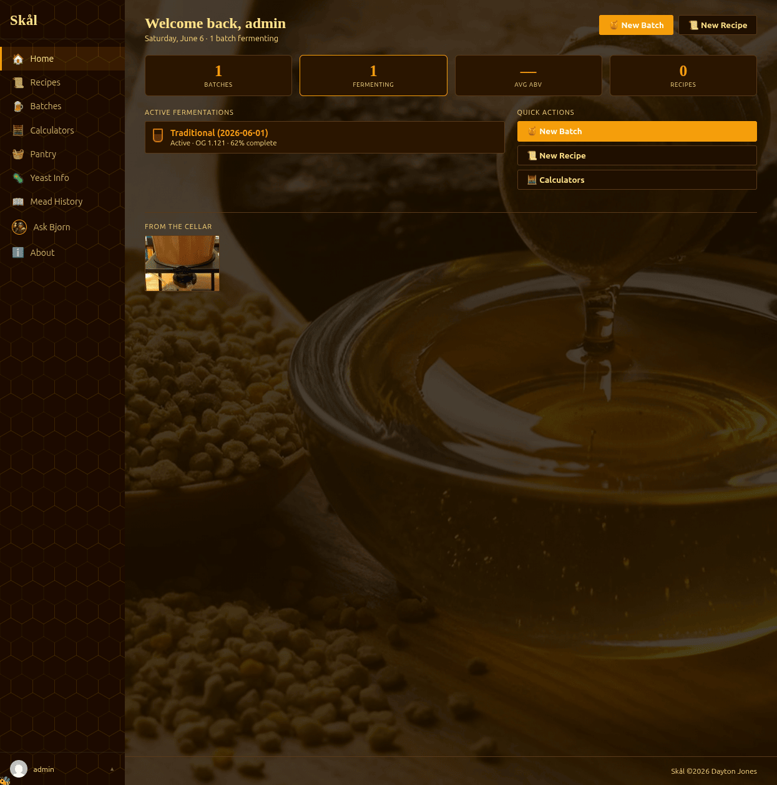
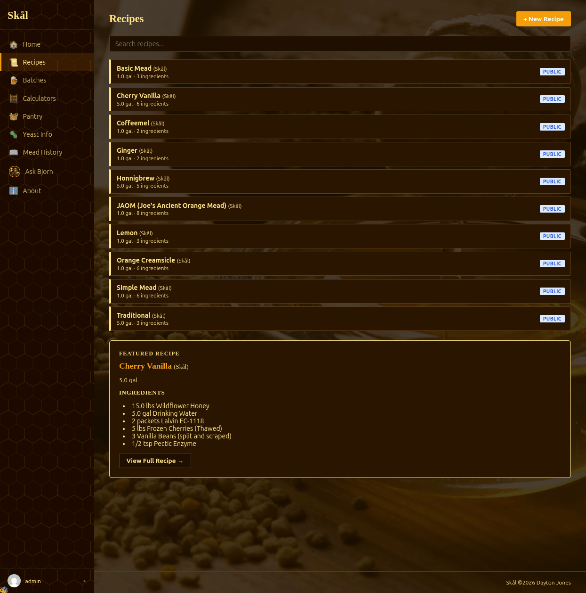
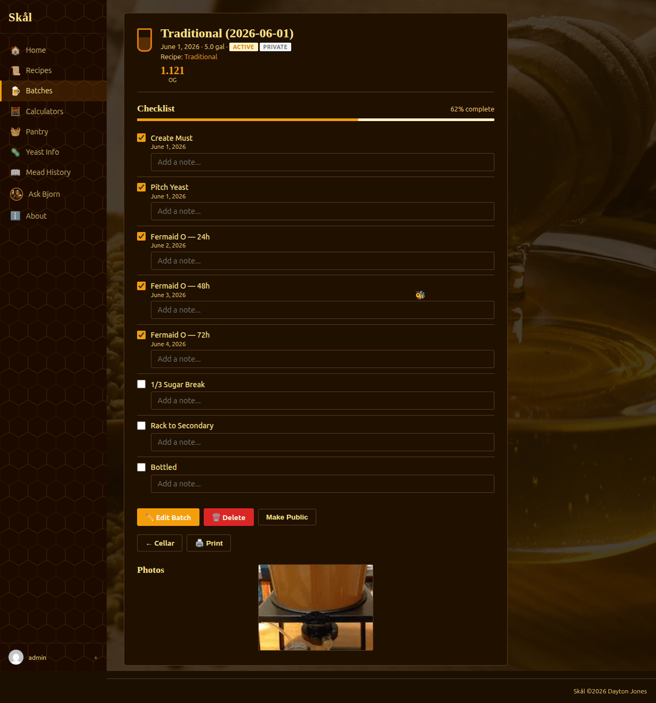
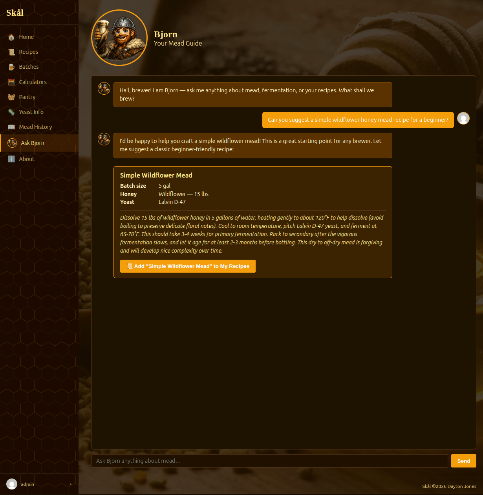
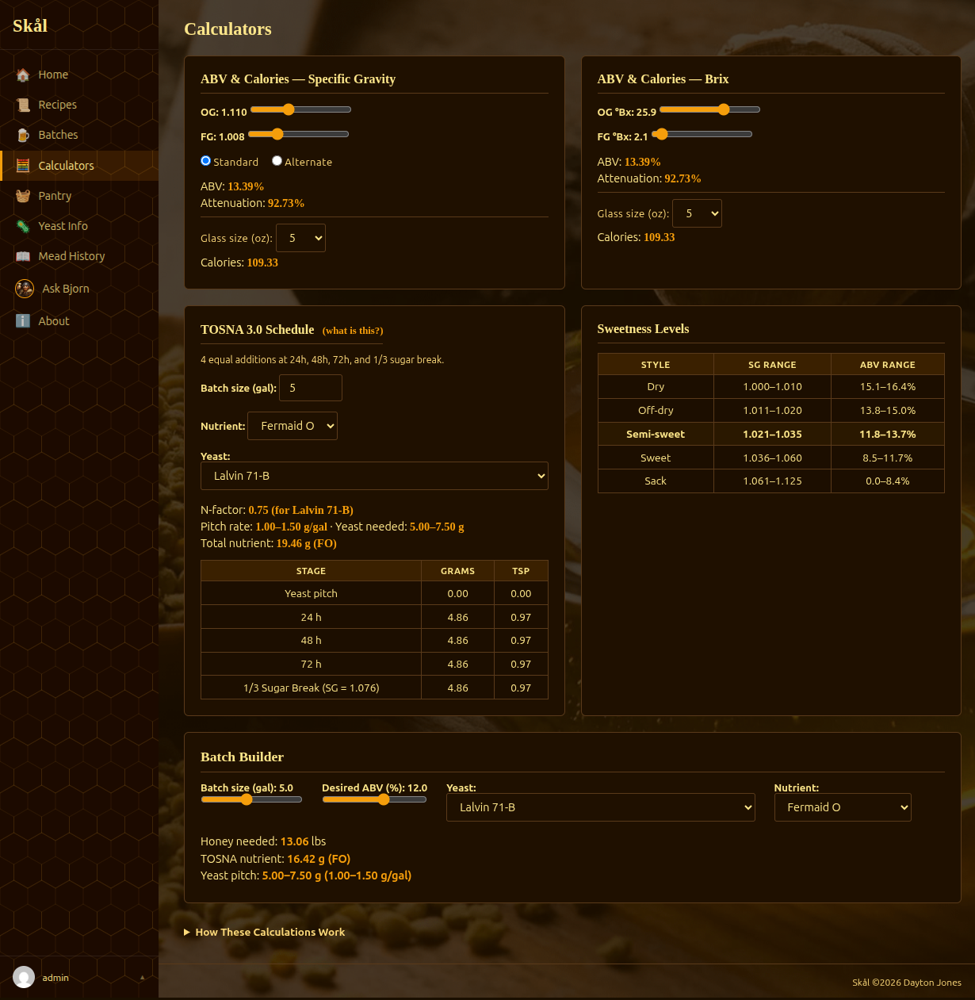
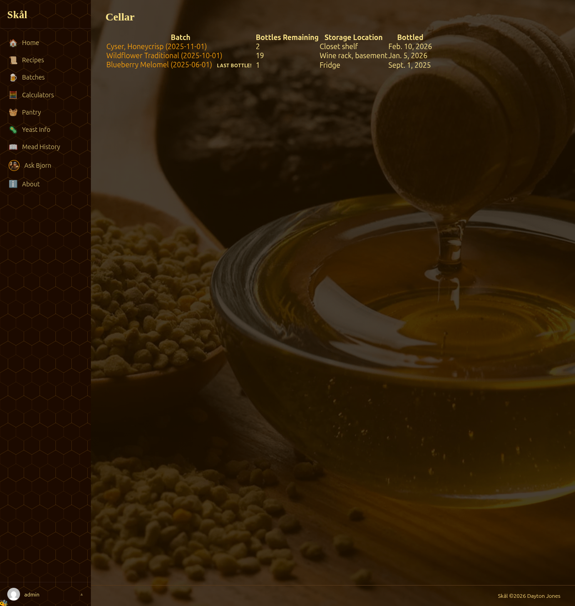
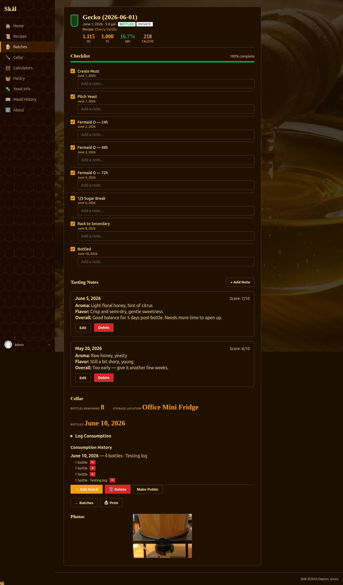
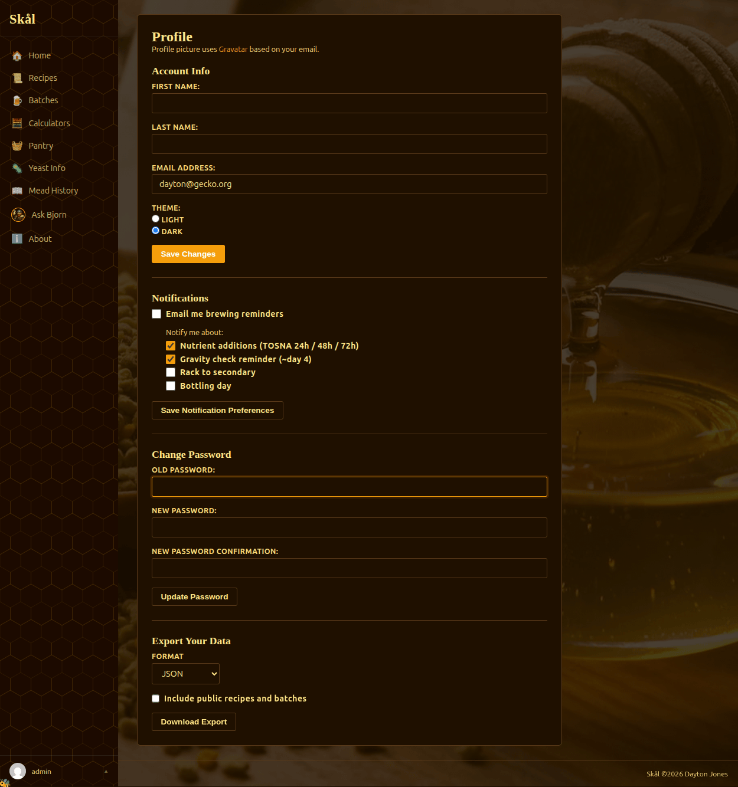

# Skål

[](https://github.com/daytonjones/Skal/releases)
[](https://github.com/daytonjones/Skal/commits/main)
[](https://github.com/daytonjones/Skal)
[](https://github.com/daytonjones/Skal/issues)
[](https://github.com/daytonjones/Skal/stargazers)
[](https://github.com/daytonjones/Skal/blob/main/LICENSE)
[](https://www.djangoproject.com)
[](https://www.python.org)
[](https://www.postgresql.org)
[](https://htmx.org)
[](https://docs.docker.com/compose/)

[](http://makeapullrequest.com)
[](https://www.buymeacoffee.com/drunkengecko)

**Skål** is a modern web application for managing your mead-making journey — from crafting recipes to tracking fermentation batches, calculating ABV, managing your ingredient pantry, and getting help from an AI brewing assistant. Designed for homebrewers who want a clean, focused tool rather than a spreadsheet.

Though built with mead in mind, Skål works just as well for beer and cider.

---

## Features

- **Recipe Management** — Create, edit, browse, and export recipes with ingredients and instructions. Toggle public/private visibility. One-click clone to fork a community recipe.
- **Batch Tracking** — Log batches from must creation through bottling. Track OG/FG, primary/secondary/bottle dates, notes, and a full TOSNA 3.0 nutrient schedule.
- **Tasting Log** — Record aroma, flavor, overall impressions, and a 1–10 score per batch. Notes appear on the batch detail page in reverse-chronological order.
- **Cellar Tracker** — Set a bottle count and storage location after bottling. Log consumption events to track remaining inventory. A dedicated `/cellar/` view surfaces all bottled batches with a last-bottle warning.
- **Email Notifications** — Opt-in reminders for TOSNA additions, gravity checks, racking, and bottling. Delivered daily; configured per-user on the profile page.
- **Photo Galleries** — Upload batch photos with captions. A slideshow of your latest brews rotates on the home dashboard.
- **Bjorn AI Assistant** — Ask Bjorn (your Viking mead guide) brewing questions, get recipe suggestions, and save them directly to your recipe list with one click.
- **Yeast Reference Table** — Compare yeasts by tolerance, attenuation, and suggested use with sorting and search.
- **ABV & Calorie Calculator** — Alternate formula ABV, estimated calories per 5 oz glass. SG/Brix fields stay linked.
- **Pantry** — Track ingredients you have on hand; recipe detail shows what you're missing.
- **Export** — Download recipes and batches as PDF, CSV, JSON, TXT, or SQL.
- **Multi-User** — Each user manages their own data; public recipes/batches are visible to all members.
- **Light & Dark Theme** — Stored per user profile. Automatic Gravatar support.
- **Pagination** — Recipe and batch lists paginate at 20 per page with search/filter preserved across pages.
- **Responsive Design** — Works on desktop and mobile.

---

## Screenshots

| Home Dashboard | Recipe List | Batch Detail |
|---|---|---|
|  |  |  |

| Bjorn AI Chat | Calculators |
|---|---|
|  |  |

| Cellar Tracker | Tasting Notes | Email Notifications |
|---|---|---|
|  |  |  |

---

## Quick Start (Docker Compose)

### Prerequisites

- [Docker](https://docs.docker.com/get-docker/) & [Docker Compose v2](https://docs.docker.com/compose/install/)

### Option A — Interactive Install Script (recommended)

```bash
git clone https://github.com/daytonjones/Skal.git
cd Skal
./install.sh
```

The install script walks you through every configuration option step by step, writes your `.env` file, builds and starts the containers, and optionally configures the Bjorn AI assistant.

### Option B — Manual Setup

**1. Clone the repo**

```bash
git clone https://github.com/daytonjones/Skal.git
cd Skal
```

**2. Create a `.env` file**

```dotenv
SECRET_KEY=your-secret-key-here
DEBUG=False
POSTGRES_DB=skal
POSTGRES_USER=skaluser
POSTGRES_PASSWORD=yourpassword
DJANGO_ALLOWED_HOSTS=localhost,127.0.0.1,yourdomain.com
DJANGO_SUPERUSER_USERNAME=admin
DJANGO_SUPERUSER_EMAIL=admin@example.com
DJANGO_SUPERUSER_PASSWORD=yourpassword

# Optional — Bjorn AI assistant (leave blank to disable)
AI_PROVIDER=anthropic
AI_API_KEY=sk-ant-...
```

**3. Build and start**

```bash
docker compose up --build -d
```

The app applies migrations, seeds starter recipes, and creates the superuser on first run.

**4. Visit [http://localhost:8000](http://localhost:8000)**

Log in as your superuser, then go to **Admin → Users** to approve any new registrations.

---

## Configuration

All configuration is via environment variables in `.env`.

### Required

| Variable | Description |
|---|---|
| `SECRET_KEY` | Django secret key — generate one with `python -c "import secrets; print(secrets.token_urlsafe(50))"` |
| `DEBUG` | `False` for production, `True` for local dev |
| `POSTGRES_DB` | Database name (default: `skal`) |
| `POSTGRES_USER` | Database user |
| `POSTGRES_PASSWORD` | Database password |
| `DJANGO_ALLOWED_HOSTS` | Comma-separated hostnames/IPs |
| `DJANGO_SUPERUSER_USERNAME` | Auto-created admin username |
| `DJANGO_SUPERUSER_EMAIL` | Admin email |
| `DJANGO_SUPERUSER_PASSWORD` | Admin password |

### Optional — Bjorn AI Assistant

| Variable | Description |
|---|---|
| `AI_PROVIDER` | `anthropic` or `openai` (leave blank to disable Bjorn entirely) |
| `AI_API_KEY` | Your API key for the chosen provider |

When `AI_PROVIDER` is set, a "Ask Bjorn" link appears in the sidebar for all logged-in users. The assistant is scoped to mead/homebrewing topics only. Usage (tokens per user) is tracked and emailed to admins weekly.

---

## Bjorn AI Assistant

Bjorn is a Viking mead-making expert built into Skål. He knows your recipes and active batches, can answer brewing questions, troubleshoot fermentation issues, and suggest new recipes.

**Supported providers:**
- [Anthropic Claude](https://console.anthropic.com/) — `AI_PROVIDER=anthropic`
- [OpenAI](https://platform.openai.com/) — `AI_PROVIDER=openai`

**Recipe suggestions:** When Bjorn suggests a recipe, a save card appears in the chat. Click **Add to My Recipes** to save it directly to your recipe list — honey, yeast, additives, and instructions all included.

**Usage reporting:** A weekly email is sent to Django admins summarising token usage per user. You can also run it manually:

```bash
docker compose exec web python manage.py send_ai_report
```

---

## Upgrading

Use the upgrade script to safely back up your data and apply new migrations:

```bash
./upgrade.sh
```

This creates a timestamped SQL backup in `backups/`, rebuilds the image, and restarts containers.

---

## Usage Overview

| Page | What you can do |
|---|---|
| **Home** | See your latest batches as a rotating slideshow; quick links to recent activity |
| **Recipes** | Browse, search, create, edit, delete, clone, and export recipes; Featured Recipe panel |
| **Batches** | Track brews from must to bottle; checklist, gravity log, photo gallery, nutrient schedule |
| **Bjorn** | Chat with your AI brewing guide; save AI-suggested recipes |
| **Pantry** | Track ingredient stock; see what you have vs. what a recipe needs |
| **Calculators** | ABV and calorie calculator with linked SG/Brix fields |
| **Yeast Table** | Search and compare yeast strains |
| **Profile** | Display name, avatar, theme preference, account settings |
| **Admin** | Approve users, manage ingredients, view AI usage |

---

## Contributing

1. Fork the repository
2. Create a feature branch (`git checkout -b feature/your-feature`)
3. Write tests and commit your changes
4. Open a pull request with a description of what changed and why

---

## License

MIT License. See [LICENSE](LICENSE) for full details.
